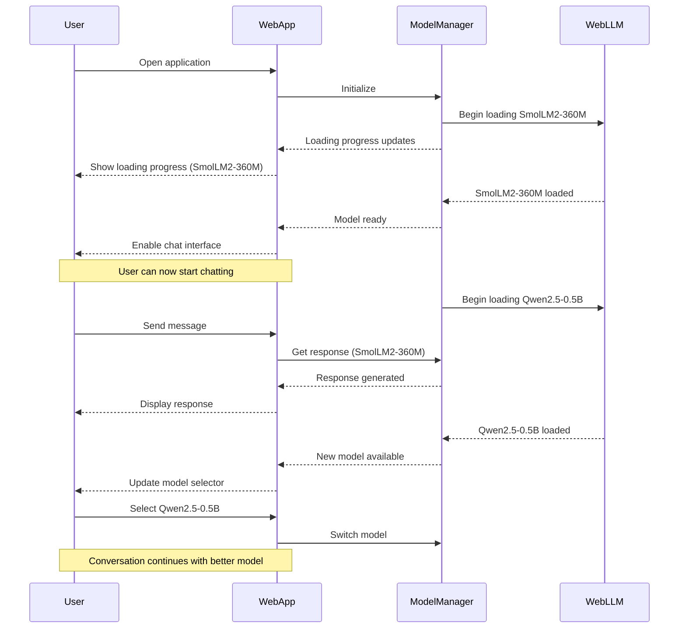
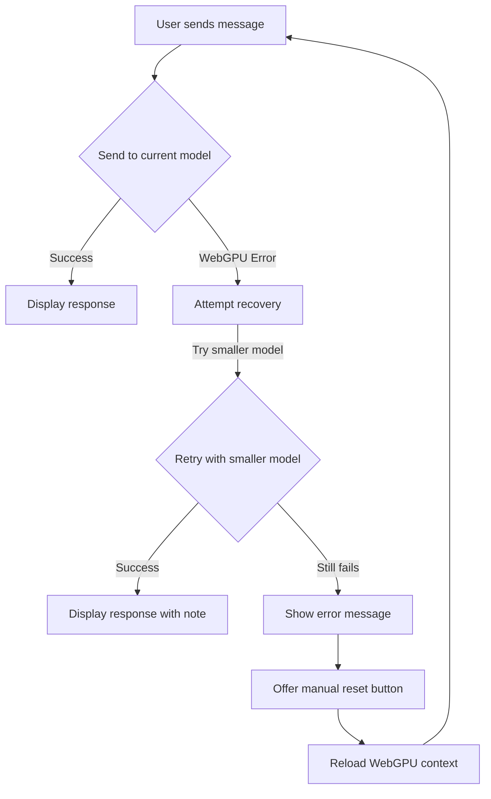
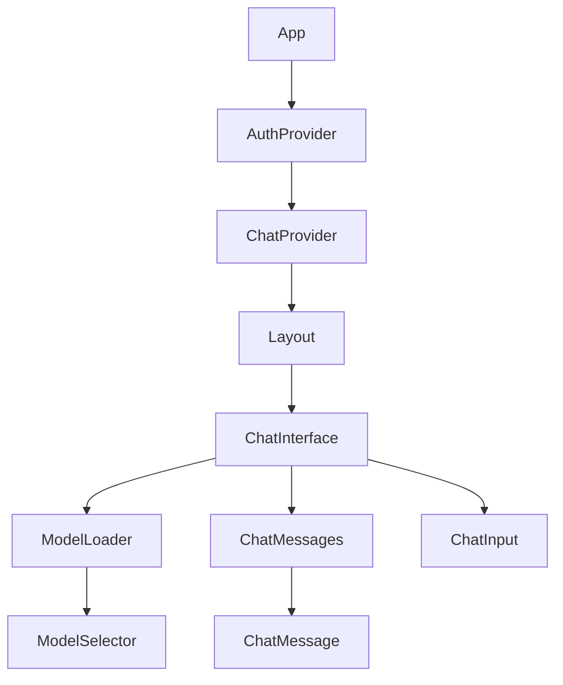

# WebLLM Chat Application

## A React-based chat interface with in-browser AI using WebLLM


## Table of Contents

- [Overview](#overview)
- [Architecture](#architecture)
- [Models](#models)
- [Progressive Loading Strategy](#progressive-loading-strategy)
- [Error Handling](#error-handling)
- [Getting Started](#getting-started)
- [Components](#components)
- [Performance Considerations](#performance-considerations)
- [Troubleshooting](#troubleshooting)
- [Advanced Usage](#advanced-usage)

## Overview

This application demonstrates the power of WebLLM to run large language models directly in the browser with WebGPU acceleration. 

Key features:
- 🧠 In-browser AI powered by WebLLM
- 🔒 Privacy-focused (all processing happens locally)
- ⚡ Progressive model loading for fast startup
- 👤 User authentication with Clerk
- 🎨 Responsive design with Tailwind CSS
- 🌙 Dark mode support

## Architecture

The application follows a modular architecture to efficiently manage model loading, user interaction, and state management.


### Core Components

1. **ModelManager**: Handles loading, caching, and switching between LLM models
2. **ChatContext**: Manages chat messages and model interactions
3. **AuthProvider**: Handles user authentication with Clerk
4. **UI Components**: Renders the chat interface, messages, and loading states

## Models

WebLLM supports a variety of models, each with different sizes, capabilities, and loading times.

### Model Performance Comparison

| Model | Size | VRAM Required | Load Time (First Visit) | Load Time (Cached) | Best For |
|-------|------|---------------|-------------------------|-------------------|----------|
| SmolLM2-135M | 135M | 360MB | 10-20s | 5-10s | Quick responses, very basic tasks |
| SmolLM2-360M | 360M | 376MB | 15-30s | 5-15s | Simple chat, limited understanding |
| Qwen2.5-0.5B | 500M | 945MB | 20-40s | 10-20s | Better comprehension, still fast |
| TinyLlama-1.1B | 1.1B | 697MB | 30-60s | 15-30s | Good balance of speed/quality |
| Phi-3-mini | 3.8B | 3.7GB | 1-2min | 30-60s | Strong performance, slower loading |
| Llama-3.1-8B | 8B | 5.3GB | 2-5min | 1-2min | High-quality responses, slow loading |

### Model Size vs. Performance


### Loading Time vs. Model Quality


## Progressive Loading Strategy

The application implements a smart loading strategy to provide the best user experience:

1. **Start Small, Grow Big**: Loads the smallest model first, then progressively loads larger models in the background
2. **Instant Interaction**: Users can start chatting with the smallest model within seconds
3. **Seamless Upgrades**: Users can switch to more powerful models as they become available

### Loading Sequence Diagram



### Progressive Loading Flow


## Error Handling

WebLLM can encounter various issues, particularly with WebGPU resources. The application implements robust error handling to ensure a good user experience even when problems occur.

### Common WebGPU Errors and Solutions

| Error | Cause | Solution |
|-------|-------|----------|
| "Instance dropped in onSubmittedWorkDone" | WebGPU context lost | Reload the page or reset WebGPU context |
| "Failed to execute 'mapAsync' on 'GPUBuffer'" | GPU buffer inaccessible | Reduce context size or switch to smaller model |
| "Out of memory" | GPU memory exhausted | Use smaller models or reduce batch size |
| "Shader module compilation failed" | Shader compilation issue | Ensure device supports WebGPU features needed |

### Error Recovery Flow



## Getting Started

### Prerequisites

- Node.js 18+
- Modern browser with WebGPU support (Chrome 113+, Edge 113+, or Firefox with flags)
- GPU with enough memory for model loading

### Installation

```bash
# Clone the repository
git clone https://github.com/your-username/webllm-chat-app.git
cd webllm-chat-app

# Install dependencies
npm install

# Set up environment variables
cp .env.example .env
# Add your Clerk keys to .env

# Start the development server
npm run dev
```

### Environment Variables

```
VITE_CLERK_PUBLISHABLE_KEY=your_clerk_publishable_key
VITE_CLERK_SECRET_KEY=your_clerk_secret_key
VITE_WEBLLM_DEFAULT_MODEL=SmolLM2-360M-Instruct-q4f16_1-MLC
```

## Components

The application is organized into several key components:

### Component Hierarchy



### Key Component Descriptions

#### ModelManager Hook (`useModelManager.js`)

Handles all aspects of model loading and management:

```javascript
const {
  availableModels,         // List of all models with metadata
  activeModel,             // Currently active model ID
  isLoading,               // Whether any model is loading
  loadingProgress,         // Current loading progress (0-100)
  loadingStatus,           // Text description of loading state
  switchModel,             // Function to switch active model
  isModelLoaded,           // Check if a model is loaded
  chat,                    // Function to get non-streaming response
  streamChat               // Function to get streaming response
} = useModelManager();
```

#### ChatContext Provider (`ChatContext.jsx`)

Manages the chat conversation and interfaces with the model manager:

```javascript
const {
  messages,                // Array of all chat messages
  sendMessage,             // Function to send a message
  sendMessageStream,       // Function to send a message with streaming response
  clearChat,               // Function to clear the conversation
  changeModel,             // Function to change the active model
  currentModel,            // ID of current model
  availableModels,         // List of all models
  isLoading,               // Whether a response is being generated
  error                    // Any error that occurred
} = useChat();
```

## Performance Considerations

### WebGPU Memory Management

WebGPU memory is a critical resource when running LLMs in the browser. Memory usage depends on:

1. **Model Size**: Larger models require more VRAM
2. **Context Length**: Longer context windows use more memory
3. **Batch Size**: Affects memory during processing
4. **Quantization**: Lower precision (e.g., q4f16_1) uses less memory

### Memory Usage by Context Length


### Optimizing Performance

1. **Reduce Context Size**: Use shorter context windows (1024 tokens instead of 4096)
2. **Choose Quantized Models**: Use q4f16_1 models instead of q4f32_1 when possible
3. **Progressive Loading**: Load smaller models first, then larger ones
4. **Memory Cleanup**: Clear unused models from memory when switching

## Troubleshooting

### Common Issues

#### WebGPU Not Available

**Symptoms**: Application shows "WebGPU not supported" message  
**Solutions**:
- Use Chrome 113+ or Edge 113+
- For Firefox, enable WebGPU in about:config
- Update GPU drivers
- Check if hardware acceleration is enabled

#### Model Loading Failures

**Symptoms**: Model fails to load with WebGPU errors  
**Solutions**:
- Try a smaller model
- Reduce the context window size
- Close other GPU-intensive applications
- Refresh the page to reset WebGPU context

#### Out of Memory Errors

**Symptoms**: "Out of memory" errors when loading or using models  
**Solutions**:
- Use smaller models (SmolLM2-360M instead of Phi-3-mini)
- Reduce context size in model configuration
- Use more aggressive quantization (q4f16_1 instead of q4f32_1)
- Limit the number of models loaded simultaneously

#### Cannot Type in Chat Input

**Symptoms**: Chat interface shows but input field doesn't accept typing  
**Solutions**:
- Check browser console for WebGPU errors
- Try reloading the page to reset WebGPU context
- Use the Reset GPU button if available
- Try a smaller model with less GPU memory requirements
- Close other browser tabs or applications using GPU resources

### Diagnosing WebGPU Issues

The WebGPU Analyzer in Chrome DevTools can help diagnose issues:

1. Open DevTools (F12)
2. Go to the "Application" tab
3. Select "WebGPU" in the sidebar
4. Examine buffer usage and errors

## Advanced Usage

### Custom Model Configuration

You can customize the models loaded by the application:

```javascript
// Create a custom app configuration
const customAppConfig = {
  useIndexedDBCache: true,
  model_list: [
    {
      model: "https://huggingface.co/mlc-ai/SmolLM2-360M-Instruct-q4f16_1-MLC",
      model_id: "SmolLM2-360M-Instruct-q4f16_1-MLC",
      model_lib: "path_to_wasm_file",
      overrides: {
        context_window_size: 1024,  // Reduced for better performance
        repetition_penalty: 1.1
      }
    }
  ]
};

// Pass to engine creation
const engine = await CreateMLCEngine(
  "SmolLM2-360M-Instruct-q4f16_1-MLC",
  { appConfig: customAppConfig }
);
```

### Using Service Worker for Persistence

Service workers can keep models loaded between page visits:

```javascript
// In sw.js
import { ServiceWorkerMLCEngineHandler } from "@mlc-ai/web-llm";

let handler;

self.addEventListener("activate", function (event) {
  handler = new ServiceWorkerMLCEngineHandler();
});

// In main.js
if ("serviceWorker" in navigator) {
  navigator.serviceWorker.register('/sw.js');
}

const engine = await CreateServiceWorkerMLCEngine(modelId);
```

---

## Further Resources

- [WebLLM Documentation](https://github.com/mlc-ai/web-llm)
- [WebGPU Documentation](https://developer.mozilla.org/en-US/docs/Web/API/WebGPU_API)
- [Clerk Authentication](https://clerk.dev/docs)
- [React Documentation](https://reactjs.org/docs/getting-started.html)

## License

This project is licensed under the MIT License - see the LICENSE file for details.